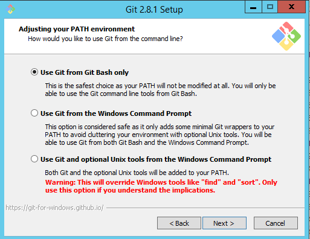
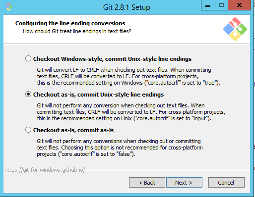
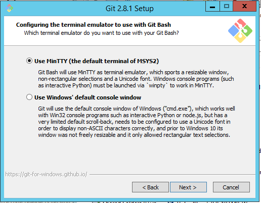

Prerequisites
=============

This section describes the hardware, software, and network resources required to complete the accompanying
lab exercises.

## Network

- Must have access to the internet so that software components required by the Virtual Machine
can be downloaded.

## Hardware

- Laptop/Desktop running Mac OS X 10.10.5 or later, or Windows 7 or later.
- Laptop/Desktop must have at least 8GB ram.
- Laptop/Desktop must have at least 2GB of free disk space.

## Software

Download each piece of software below for your OS and install each piece with the default instructions and locations

- Vagrant 1.7.2 or later. Vagrant can be downloaded [here](https://www.vagrantup.com/downloads.html)
- VirtualBox 4.3.2.6 or later. VirtualBox can be downloaded [here](https://www.virtualbox.org/wiki/Downloads)
- Chrome Browser latest version. Chrome can be downloaded from [here](https://www.google.com/chrome/browser/desktop/)
- Git 2.2 or later. Git can be downloaded [here](http://git-scm.com/download)

## Git On Windows

_NOTE_: If you are Mac OS X user you can skip this and proceed to the _Next_ section at bottom of the page,
sorry Windows people we have some special instructions for you on how to install Git on your system. We promise
this is the last time you will have to pay your penance for you _Windows_ ways, since going forward,
the instructions for all the platforms will be the same.

When using the Git installer make sure you select the options in the installation shown in the next sections.

### Adjusting your PATH environment

### Configure the line ending conversions

### Configure the terminal emulator to use with Git Bash

## Next

Click _Next_ (upper right) when completed with download and installation of all components on this page.
