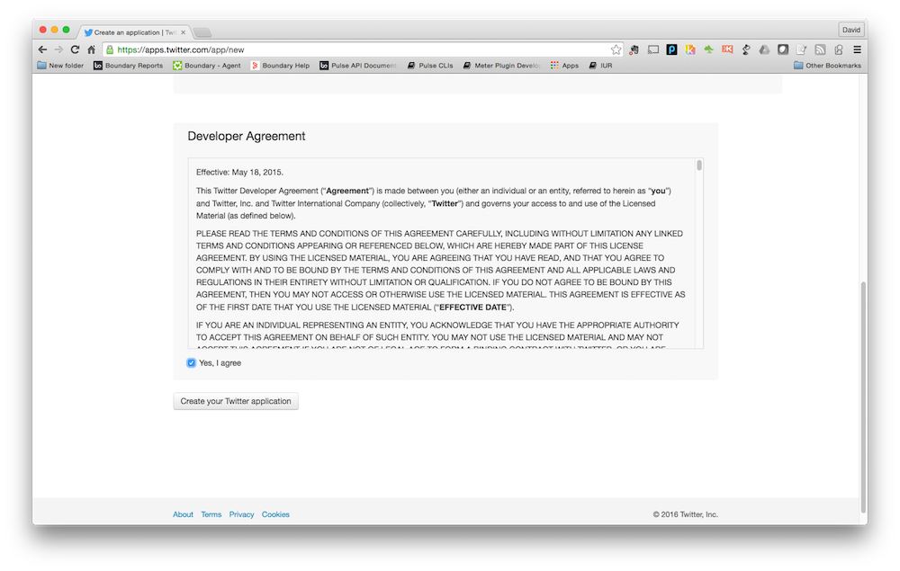

Prerequisites
=============

This section describes the hardware, software, and network resources required to complete the accompanying
lab exercises.

## Network

- Must have access to the internet so that software components required by the Virtual Machine
can be downloaded.
[https://truesight-staging.bmc.com](https://truesight.bmc.com)

## Hardware

- Laptop/Desktop running Mac OS X 10.10.5 or later, or Windows 7 or later.
- Laptop/Desktop must have at least 8GB ram.
- Laptop/Desktop must have at least 2GB of free disk space.

## Software

Download each piece of software below for your OS and install each piece with the default instructions and locations

- Vagrant 1.7.2 or later. Vagrant can be downloaded [here](https://www.vagrantup.com/downloads.html)
- VirtualBox 4.3.2.6 or later. VirtualBox can be downloaded [here](https://www.virtualbox.org/wiki/Downloads)
- Chrome Browser latest version. Chrome can be downloaded from [here](https://www.google.com/chrome/browser/desktop/)
- Git 2.2 or later. Git can be downloaded [here](http://git-scm.com/download). When installing Git on Windows
there are special instructions as described in the next section.

## Git On Windows

_NOTE_: If you are Mac OS X user you can skip this and proceed to the _Next_ section at bottom of the page,
sorry Windows people we have some special instructions for you on how to install Git on your system. We promise
this is the last time you will have to pay your penance for you _Windows_ ways, since going forward,
the instructions for all the platforms will be the same.

When using the Git installer make sure you select the options in the installation shown in the next sections.

### Adjusting your PATH environment

### Configure the line ending conversions

### Configure the terminal emulator to use with Git Bash

## API Keys

For the following labs you will need to create a API keys to access to their data:

- Open Weather Map visit [here](http://openweathermap.org/appid)
- Twitter visit [here](https://apps.twitter.com/)

Sections below provide details on how create API keys.

### Open Weather Map

1. Click on the link [here](http://openweathermap.org/appid) and click on the orange button labeled
 _Sign up_ which will display the following:

3. Complete the form and click on the _Create Account button_ which then displays the API key:

### Twitter

1. Click the link [here](https://apps.twitter.com/). and click on the button labeled
_Create New App_ in the right-hand side of the page:

2. Complete the form with a unique _name_, _description_, and `http://www.bmc.com` for _Website_.

3. Click on the check box _Yes, I agree_ to accept the developer agreement and click on the button labeled _Create your Twitter
application_:

4. The new application is created.

5. Next click on the tab labeled _Keys and Access Tokens_ to display:

6. Click on the button labeled _Generate My Access Token_ which then displays the access tokens:

## Next

Click _Next_ (upper right) when completed with download and installation of all components on this page.
