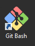

Virtual Machine
===============

This section describes how to get your virtual machine environment up and running on
your Windows or Mac OS X laptop or Desktop.

Before proceeding ensure that you have met the prerequisites listed [here](prerequisites.md)

### Starting a Bash Shell

#### Mac OS X

The Bash shell on Mac OS X or _Terminal_ can be found in _Applications -> Utilities_

#### Windows

From _Program Start_ menu select _Git Bash_ or click on the program icon in the desktop if created
during installation:



### Downloading the Contents

The virtual machine contents are downloaded from a GitHub repository.

#### Cloning

Use the git command line tool in a bash shell to clone the contents of the virtual machine
from the GitHub Repository. Pay attention and make note of the directory location you are currently
in when executing the command below.

[Danger!, Will Robinson](https://youtu.be/OWwOJlOI1nU) **Do Not Install In Path With Spaces!**

```bash
$ git clone https://github.com/boundary/tsi-lab
```

#### Updating

To get the latest content of labs run the following:

1. Change directory to where you previous cloned the GitHuB repository to your laptop/desktop:

    ```
    $ cd <your cloned directory
    ```

2. Run the following command to update with the latest contents:

    ```
    $ git pull
    ```

### Creating and Starting the Virtual Machine

Interaction with the APIs requires the following details:

- E-mail - The e-mail associated with your TrueSight Intelligence account.
- API Token - The token generated by the system for authenticating a call to the API
- Application Id - Your application name used for all of the labs  (any name you want)

_NOTE_: To create the virtual machine you need to use a bash shell, or Windows Command prompt.

1. Change to directory of the extracted or cloned the lab contents:

     ```
     $ cd tsi-lab
     ```

2. From the bash shell (Terminal in OSX) or (GitBash in Windows). Issue the following command to
create the virtual machine:

     ```
     $ ./vm-create
     ```

The above script will prompt for the information that was required:

- E-mail
- API Token
- Application Id

The final screen will show the values of the above as shown here:

```
Create Virtual Machine:
1) Create Virtual Machine
2) Change E-mail: "randy_knaub@bmc.com"
3) Change API Token: "<api token"
4) Change Application Id: "BigDog"
5) Quit
#?
```

- Select item 1 to create the virtual machine.

- Select items 2-4 to update any information

- Select item 5 to quit.

_NOTE_: The details of the create virtual machine are written to `vm.log` in the directory where you
ran `./vm-create`.

### Login into the Virtual Machine

After your virtual machine is created login to your virtual machine by using the command below.

```bash
$ ./vm-login
```
### Change directory to your labs directory

After you login to your virtual machine change directory to your labs directory by using the command below.

```bash
$ cd labs
```

### Validating API credentials in your Virtual Machine

After logging into the virtual machine run the following command to verify your API credentials:

```bash
$ creds
TSP_EMAIL=rknaub@gmail.com
TSP_API_HOST=api.truesight-staging.bmc.com
TSP_API_TOKEN=fbecec7a-b0f7-40c4-a4cb-ec09b3b6b7cb
```

### Display your Application Id in your Virtual Machine

``` bash
$ appid
TSI_APP_ID=BigDog
```

### Virtual Machine Commands

All of the command that follow assume that you are not logged into the virtual machine.

To logout of the virtual machine use the `exit` command which will return you to
your laptop/desktop.

#### Stopping the Virtual Machine

Run the following command before shutting down you laptop/desktop.

```bash
$ ./vm-stop
```

#### Starting the Virtual Machine

Run the following command to restart your virtual machine.

```bash
$ ./vm-start
```

#### Restarting the Virtual Machine

Run the following command to restart your virtual machine.

```bash
$ ./vm-restart
```

#### Destroying the Virtual Machine

```bash
$ ./vm-remove
```

Click Next (upper right) when completed.

