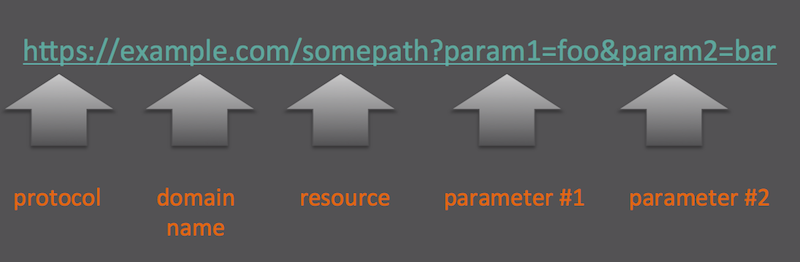

Lab 2 - Introduction ReST
=========================

## Overview

This lab introduces ReST or *R*epresentational *S*tate *T*ransfer. ReST was defined
by Roy Thomas Fielding in his 2000 PhD dissertation _Architectural Styles and the Design
of Network-based Software Architectures_ ReST is just a fancy name for protocol you use
everyday in a web browser called HTTP
[(*H*yper*t*ext *T*ransfer *P*rotocol)](https://en.wikipedia.org/wiki/Hypertext_Transfer_Protocol).

This section provides the essential background to understand how to use the HTTP protocol with
practical exercises using [curl](https://en.wikipedia.org/wiki/CURL) command line utility.

The last part of this lab provides a quick overview of the ReST API provided to manipulate:

- Metrics
- Measures
- Events

## The HTTP Protocol

A logical starting to talk about the HTTP protocol is to talk about the HTTP request methods.
One of the most prevalent of these HTTP methods is `GET` which is readily used by a browser


### URI

A _URI_ or *U*niform *Resource* *L*ocator is a string of characters used to identify a resource.
The most prevalent form of a URI is a _URL_ or *U*niform *Resource* *L*ocator usually called a
_web address_. A notated example of URL is shown here:



Fields are delineated by double quotes(_"_) and can have data types of numbers, strings, and booleans.
Additional array of these same data types can be formed. Object structures are created by enclosing
command separate fields between braces (_{_ and _}_).

### Headers

### Authentication

### Status Codes

When HTTP request method (`GET`, `POST`, `PUT`, `DELETE`) is issued to a endpoint the HTTP protocol accounts
for returning a status code indicating the result of the request. The Status codes themselves
are classified by the range of their values:

- 2XX - Success - The request was received and processed successfully.
- 3XX - Redirection - The client must must take additional action to complete the request.
- 4XX - Client Error - The clients request has an error of some type and could not be completed.
- 5XX - Server Error - The server failed to fulfil a request

For the sake of this lab, and the APIs to be introduced later, the table shows the relevant HTTP status
codes we need to be aware of:

|Status Code                | Description                                                                                              |
|:--------------------------|:-------------------------------------------------------------------------|
| 200 OK                    | Standard response for successfull requests .                             |
| 201 CREATED               | Port of the Kafka JMX endpoint. Defaults to 9990.                        |
| 202 ACCEPTED              | Username of the Kafka JMX endpoint.                                      |
| 400 BAD REQUEST           | The server is unable to process the client request that is in error.     |
| 401 UNAUTHORIZED          | Authentication is required but was not provided by the client.           |
| 404 NOT FOUND             | The request resource could not be found.                                 |
| 422 UNPROCESSABLE ENTITY  | The request was well-formed but contains a semantic error.               |
| 500 INTERNAL SERVER ERROR | A generic error, when unexpected condition was encountered.              |
| 503 SERVICE UNAVAILABLE   | The server is currently unavailable (overloaded or down for maintenance).|
| 504 GATEWAY TIMEOUT       | The server did not receive a timely response from the upstream server.   |

### JSON

JSON or [Java Script Object Notation](https://en.wikipedia.org/wiki/JSON) while not specifically
part of HTTP is a prerequisite for the TrueSight Pulse APIs to be introduced later.

JSON (Not to be confused with [Jason Voorhees](https://en.wikipedia.org/wiki/Jason_Voorhees)
of the [Friday the 13th](https://en.wikipedia.org/wiki/Friday_the_13th_(franchise)) series) is a:

- Open Standard Format
- Human Readable

The best way to learn JSON is to observe a JSON as shown here:

```
{
  "firstName": "John",
  "lastName": "Smith",
  "isAlive": true,
  "age": 25,
  "address": {
    "streetAddress": "21 2nd Street",
    "city": "New York",
    "state": "NY",
    "postalCode": "10021-3100"
  },
  "phoneNumbers": [
    {
      "type": "home",
      "number": "212 555-1234"
    },
    {
      "type": "office",
      "number": "646 555-4567"
    },
    {
      "type": "mobile",
      "number": "123 456-7890"
    }
  ],
  "children": [],
  "spouse": null
}
```


## Using `curl` to make REST calls.

The `curl` command line utility permits the issuing http(s) request from the command line.
The following are examples of its use, which later be used to call the actual APIs.


## Exercise 2-1 Example`GET` request
```
[vagrant@tsi-lab-01 ~]$ curl -X GET -s https://httpbin.org/get 
{
  "args": {}, 
  "headers": {
    "Accept": "*/*", 
    "Host": "httpbin.org", 
    "User-Agent": "curl/7.29.0"
  }, 
  "origin": "198.147.195.5", 
  "url": "https://httpbin.org/get"
}
```

### Example GET with parameters
```
[vagrant@tsi-lab-01 ~]$ curl -X GET -s 'https://httpbin.org/get?foo=bar&color=red'
{
  "args": {
    "color": "red", 
    "foo": "bar"
  }, 
  "headers": {
    "Accept": "*/*", 
    "Host": "httpbin.org", 
    "User-Agent": "curl/7.29.0"
  }, 
  "origin": "198.147.195.5", 
  "url": "https://httpbin.org/get?foo=bar&color=red"
}
```

### Example `POST`


### Example `PUT`


### Example `DELETE`


### Example `POST` with a `JSON` payload


### Status Codes


## TrueSight Pulse APIs

- Metrics
- Measurements
- Events

### Metrics

Metrics are the _thing_ to be measured like CPU or network traffic. A metric is uniquely identified by its name.


##### APIs
- Create
- Get
- Update
- Delete

### Measurements

Measurements represent the the actual time series data point. A measurement consists of 4 pieces of information:

- metric
- value
- source
- timestamp

The timestamp is optionally.

##### APIs

- Create
- Get

### Events

- Create
- Get
- List Events
- List Raw Events
